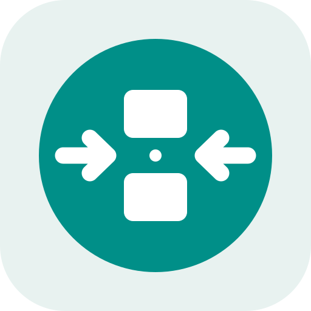

<p align="center">
  
</p>

<h1 align="center">LocalSend3DS</h1>

<p align="center"><em>Unofficial LocalSend client for Nintendo 3DS.</em></p>

LocalSend3DS provides native LocalSend-compatible file transfer between
Nintendo 3DS-family systems and LocalSend devices on the same local network. It
uses stable LocalSend protocol v2.2 and requires no companion application,
custom server, cloud service, or account.

LocalSend3DS is an independent project and is not affiliated with or endorsed
by the LocalSend maintainers or Nintendo.

## Features

- Automatic LocalSend discovery over the local network
- Single-file receiving over HTTP and sending to HTTP or HTTPS recipients
- TLS 1.2 mutual TLS and discovered-certificate fingerprint pinning
  for outgoing HTTPS transfers
- Native dual-screen interface with touch and physical-button controls
- SD-card file browser and discovered-device recipient selection
- Incoming-transfer approval, Quick Save, cancellation, and progress display
- Safe receive destinations, non-overwriting collision handling, and incoming
  SHA-256 verification when the sender provides a checksum
- Configurable device name and persistent Settings
- Homebrew Launcher `.3dsx` and native HOME Menu `.cia` builds

Received files are stored under:

```text
sdmc:/3ds/LocalSend/Downloads/
```

Transferred `.cia`, `.3dsx`, and other executable files are treated only as
data. LocalSend3DS never installs or launches received software automatically.

## Installation

### Homebrew Launcher (`.3dsx`)

Copy `LocalSend3DS.3dsx` to:

```text
sdmc:/3ds/LocalSend3DS/LocalSend3DS.3dsx
```

Launch LocalSend3DS from Homebrew Launcher. The application icon and metadata
are embedded; no sidecar assets are required.

### HOME Menu (`.cia`)

Install `LocalSend3DS.cia` using a trusted CIA installer on a system running
compatible custom firmware. The CIA is a native build of the same application
and does not require the `.3dsx` to remain on the SD card.

Settings, logs, downloads, and the persistent outgoing-TLS identity are stored
under `sdmc:/3ds/LocalSend/`, independently of CIA installation or replacement.

## Usage

### Receive a file

1. Launch LocalSend3DS and wait for Wi-Fi initialization.
2. On another LocalSend device, choose **LocalSend 3DS** or the configured
   device name as the recipient.
3. Review the sender, filename, and size on the 3DS, then accept with A or the
   touchscreen. Quick Save can optionally accept incoming requests
   automatically.
4. Find the completed file in `sdmc:/3ds/LocalSend/Downloads/`.

LocalSend3DS advertises an HTTP receive endpoint. An official peer may send to
that advertised endpoint even when the peer's own receive service advertises
HTTPS.

### Send a file

1. Open **Send**, browse the SD card, and select one file.
2. Select a discovered recipient. LocalSend3DS uses the HTTP or HTTPS protocol
   advertised by that device.
3. Accept the incoming request on the recipient and wait for both devices to
   report completion.

For HTTPS recipients, LocalSend3DS presents a persistent client certificate,
checks the recipient certificate's validity and self-signature, and pins its
exact SHA-256 fingerprint to the value learned during discovery before sending
HTTP metadata. It never silently downgrades an HTTPS recipient to HTTP. The 3DS
system date and time must be correct for certificate-validity checks.

PIN-protected recipients are not supported. Disable the recipient's PIN before
sending from LocalSend3DS; encryption itself can remain enabled.

### Controls

- D-Pad or Circle Pad: move through lists
- A: select, accept, send, or dismiss
- B: back, reject, or cancel
- Y: refresh nearby devices
- L/R: change Receive, Send, and Settings sections
- Touch: select tabs, cards, files, and actions
- SELECT: toggle the developer status view
- START: exit cleanly

Diagnostic logs are written to `sdmc:/3ds/LocalSend/logs/latest.log` and are
capped per launch. Logs can contain peer names, LAN IP addresses, filenames,
sizes, and certificate-fingerprint prefixes. Review them before sharing.

## Build

Install devkitPro using its supported installation method, then install the
`3ds-dev` package group and the official `3ds-mbedtls` package:

```sh
sudo dkp-pacman -Syu
sudo dkp-pacman -S 3ds-dev 3ds-mbedtls
```

Ensure `DEVKITPRO` and `DEVKITARM` are configured. LocalSend3DS v1.0.0 targets
devkitPro's `3ds-mbedtls` 2.28.8 package.

Build the standard `.3dsx`:

```sh
make
```

Run platform-independent host tests:

```sh
brew install mbedtls@2
make -f Makefile.host test
```

The Homebrew package is needed only for native macOS tests, not at runtime on
the 3DS.

The optional native CIA build additionally requires compatible `bannertool`
and `makerom` executables:

```sh
make cia BANNERTOOL=/path/to/bannertool MAKEROM=/path/to/makerom
```

See [packaging/cia/README.md](packaging/cia/README.md) for native CIA packaging
details and [docs/testing.md](docs/testing.md) for the complete validation
procedure.

## Compatibility and known limitations

Real-hardware testing currently covers a New Nintendo 2DS XL with official
LocalSend peers on macOS, Linux, and Android:

- macOS: bidirectional discovery and one-file transfer are verified, including
  3DS-to-macOS HTTPS/mTLS with fingerprint pinning and persistent client-identity
  reuse after an application restart.
- Linux: bidirectional discovery and one-file transfer are verified, including
  3DS-to-Linux HTTPS/mTLS with fingerprint pinning.
- Android: bidirectional discovery and one-file transfer are verified. No
  independent checksum comparison or Android-specific cancellation/failure-path
  coverage was reported.

The outgoing HTTPS/mTLS hardware tests used the native CIA. The TLS-enabled
`.3dsx` release candidate also launches successfully through Homebrew Launcher
on real hardware. That `.3dsx` result is a launch smoke test; transfer coverage
has not been separately attributed to that package format.

The outgoing HTTPS transfers completed on macOS and Linux, but their destination
files have not yet received an independent size or SHA-256 comparison. An
earlier HTTP transfer to macOS and an incoming macOS transfer were independently
compared byte-for-byte.

Testing has not yet covered other Nintendo 3DS-family models or official
LocalSend peers on Windows or iOS.

Current limitations:

- LocalSend3DS's incoming server advertises HTTP. HTTPS support currently
  applies only when LocalSend3DS sends to an HTTPS recipient.
- PIN-protected transfers are not implemented.
- Transfers are limited to one file per session.
- Multiple files, folders, text, clipboard, and trusted-device support are
  not implemented.
- A power loss or process termination can leave a collision-safe `.part` file.
  It is never presented as complete; LocalSend3DS does not delete an unknown
  stale `.part` file because it may belong to the user.
- Cancellation, network interruption, low-storage, lid/sleep, and large-file
  behavior have not received broad real-hardware coverage.

See [docs/compatibility.md](docs/compatibility.md) for the detailed test matrix
and verified milestones.

HTTPS protects outgoing transfer traffic and pins the recipient certificate to
the fingerprint in LocalSend discovery metadata. It does not independently
prove a person's identity, and incoming transfers still use HTTP. Quick Save
removes the normal approval prompt, so enable it only on a LAN you trust.

The outgoing-TLS identity includes a private key stored on the SD card at
`sdmc:/3ds/LocalSend/tls-identity.bin`. Protect the SD card and any backups as
you would other application data. If this identity is lost or corrupt beyond
recovery, LocalSend3DS generates a replacement before the next HTTPS send.

## Credits

LocalSend3DS is developed by Volkan 'Val March' Söylemez. It implements
interoperability with the separate [LocalSend](https://localsend.org/) project
and uses the devkitPro Nintendo 3DS homebrew toolchain and libraries.

The LocalSend3DS logo is original project artwork. Official LocalSend source
code and logo artwork are not bundled. See
[THIRD_PARTY_NOTICES.md](THIRD_PARTY_NOTICES.md) and
[docs/branding.md](docs/branding.md) for attribution and branding details.

## License

LocalSend3DS's original source code and project artwork are available under the
[MIT License](LICENSE). Copyright © 2026 Volkan 'Val March' Söylemez.
